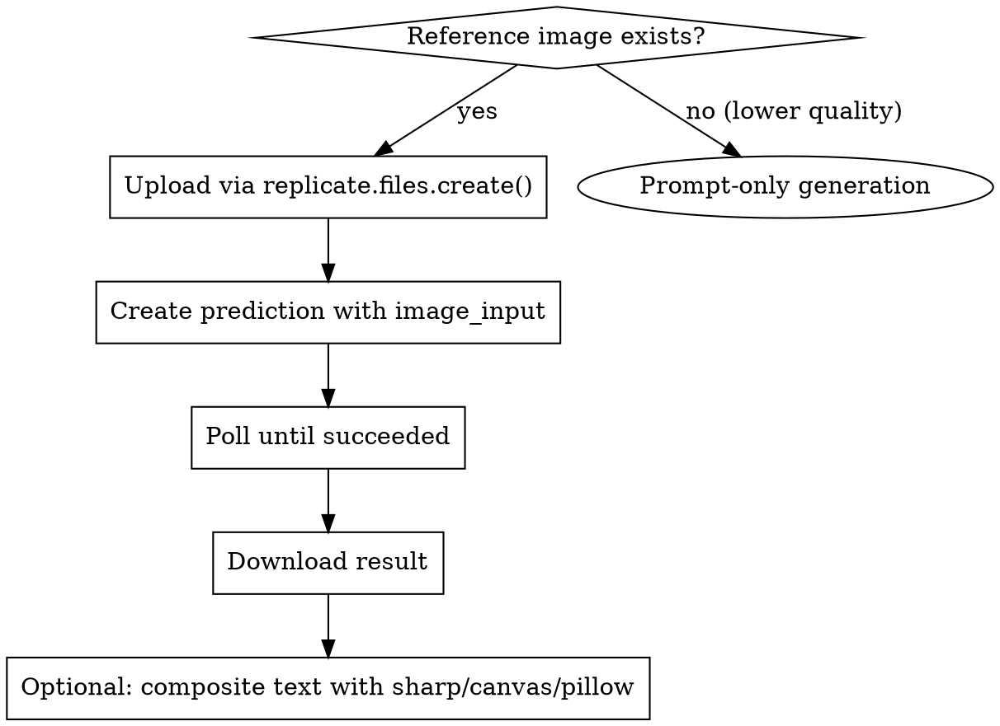

# Eduwill Banner Generator

## Overview

Generate high-quality Korean education marketing banners using **Replicate Nano Banana Pro** (`google/nano-banana-pro`) with reference image style transfer. The key to quality output is **uploading reference images via `replicate.files.create()`** and passing the URL through `image_input` — not base64, not prompt-only.

## When to Use

- User asks to create 에듀윌/Eduwill banners
- User provides reference banner images and wants similar style
- Korean education company marketing banner generation
- Any banner task mentioning 공인중개사, 합격, 교육 플랫폼

**When NOT to use:** Simple text-only banners without reference images (use satori/sharp instead).

## Brand Reference

```yaml
eduwill_colors:
  yellow: "#FCC300" # Primary brand color
  navy: "#111E50" # Trust/premium
  sky_blue: "#55ACE2" # Honesty
  red: "#F24646" # Passion
  cta_red: "#F63B28" # Web CTA buttons
  text: "#222222" # Body text

eduwill_fonts:
  primary: "Noto Sans KR" # Open substitute for 에듀윌 합격체
  web_ui: "Spoqa Han Sans Neo"
```

## Core Workflow



## Quick Reference

| Parameter              | Value                    | Notes                                                                                        |
| ---------------------- | ------------------------ | -------------------------------------------------------------------------------------------- |
| Model ID               | `google/nano-banana-pro` | NOT `nanonobandana/...`                                                                      |
| `aspect_ratio`         | `"16:9"`                 | Standard banner. Default is `"match_input_image"` when `image_input` provided                |
| `resolution`           | `"2K"`                   | High quality                                                                                 |
| `output_format`        | `"png"`                  | Lossless                                                                                     |
| `image_input`          | `[uploaded_url]`         | Must be real URL from `replicate.files.create()`, not base64. Supports up to 14 images       |
| `safety_filter_level`  | `"block_only_high"`      | Most permissive. Options: `block_low_and_above`, `block_medium_and_above`, `block_only_high` |
| `allow_fallback_model` | `false`                  | Falls back to bytedance/seedream-5 if true and model is at capacity                          |

## Implementation

### Step 1: Upload Reference Image (Critical)

```javascript
import Replicate from "replicate";
import fs from "fs";
import "dotenv/config";

const replicate = new Replicate({ auth: process.env.REPLICATE_API_TOKEN });

// MUST upload to get a real URL — base64 data URIs don't work reliably
const buf = fs.readFileSync("inputs/reference-banner.png");
const file = await replicate.files.create(buf, {
  filename: "reference.png",
  content_type: "image/png",
});
const fileUrl = file.urls?.get || file.url;
```

### Step 2: Generate with Polling (High Demand Resilience)

```javascript
// Use predictions API with polling — replicate.run() fails under high demand
const pred = await replicate.predictions.create({
  model: "google/nano-banana-pro",
  input: {
    prompt:
      "Recreate this Korean education banner in the same style and layout. [specific details about what to keep/change]",
    image_input: [fileUrl],
    aspect_ratio: "16:9",
    resolution: "2K",
    output_format: "png",
    safety_filter_level: "block_only_high",
  },
});

// Poll until complete
let p = pred;
while (
  p.status !== "succeeded" &&
  p.status !== "failed" &&
  p.status !== "canceled"
) {
  await new Promise((r) => setTimeout(r, 5000));
  p = await replicate.predictions.get(pred.id);
}

if (p.status === "succeeded") {
  const url = typeof p.output === "string" ? p.output : p.output?.[0];
  const resp = await fetch(url);
  fs.writeFileSync("output/banner.png", Buffer.from(await resp.arrayBuffer()));
}
```

### Step 3: Retry on High Demand (E003)

```javascript
// Nano Banana Pro frequently returns E003 under load — always retry
async function generateWithRetry(input, output, retries = 5) {
  for (let i = 0; i < retries; i++) {
    try {
      const pred = await replicate.predictions.create({
        model: "google/nano-banana-pro",
        input,
      });
      let p = pred;
      while (!["succeeded", "failed", "canceled"].includes(p.status)) {
        await new Promise((r) => setTimeout(r, 5000));
        p = await replicate.predictions.get(pred.id);
      }
      if (p.status === "succeeded") {
        const url = typeof p.output === "string" ? p.output : p.output?.[0];
        const resp = await fetch(url);
        fs.writeFileSync(output, Buffer.from(await resp.arrayBuffer()));
        return output;
      }
      throw new Error(p.error);
    } catch (e) {
      console.log(`Attempt ${i + 1} failed: ${e.message.substring(0, 60)}`);
      if (i < retries - 1) await new Promise((r) => setTimeout(r, 15000));
    }
  }
  return null;
}
```

## Prompt Engineering for Eduwill Banners

**Always start with:** `"Recreate this Korean education banner in the same style and layout."`

**Then specify what to keep/change:**

| Banner Type       | Prompt Pattern                                                                          |
| ----------------- | --------------------------------------------------------------------------------------- |
| 프로모션 (옐로우) | `"...bright yellow gradient, study book on right, bold text on left, price tag"`        |
| 수상/1위 (골드)   | `"...dark gold gradient, sparkle confetti, golden trophy, award celebration"`           |
| 강사진 (베이지)   | `"...cream beige background, professional instructors in suits, CTA button"`            |
| 설명회 (다크)     | `"...dark charcoal background, LIVE badge, instructors on right, yellow CTA"`           |
| 캐릭터 (화이트)   | `"...white background, 3D cartoon students, speech bubbles, yellow bar at bottom"`      |
| 인포그래픽        | `"...split layout, comparison cards, icons (brain/lightbulb/clock), clean infographic"` |

## Post-Processing with Other Methods

After AI generation, composite text overlays using:

- **sharp**: SVG text overlay + resize → `sharp(aiImage).composite([{input: svgBuffer}]).toFile()`
- **canvas**: `loadImage(aiImage)` → `ctx.drawImage()` → draw text/shapes on top
- **pillow**: `Image.open(aiImage)` → `ImageDraw` text + gradient overlay
- **html-to-image**: AI image as `background:url(data:image/png;base64,...)` in HTML template
- **satori**: AI image as `` in JSX tree, text elements overlaid

## Common Mistakes

| Mistake                            | Fix                                                                    |
| ---------------------------------- | ---------------------------------------------------------------------- |
| Using `replicate.run()`            | Use `predictions.create()` + polling — more resilient to E003          |
| Passing base64 to `image_input`    | Upload via `replicate.files.create()` first, pass real URL             |
| Wrong model ID `nanonobandana/...` | Correct: `google/nano-banana-pro`                                      |
| Prompt-only without reference      | Always provide `image_input` with reference for quality                |
| No retry logic                     | E003 (high demand) is frequent — always retry 3-5 times with 15s delay |
| Using `1K` resolution              | Use `2K` for marketing-quality banners                                 |

## Prerequisites

```bash
npm install replicate dotenv
# .env must contain REPLICATE_API_TOKEN=r8_xxxxx
```

## Project Structure

```
banner-generator/
├── .env                  # REPLICATE_API_TOKEN
├── inputs/               # Reference banner images
├── output/               # Generated banners
├── fonts/
│   ├── NotoSansKR-Bold.ttf
│   └── NotoSansKR-Regular.ttf
└── src/
    └── replicate/
        └── generate.js   # Core generation module
```
